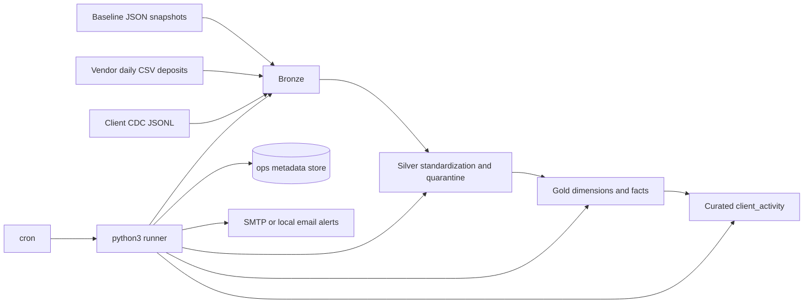

# Part 1: Pipeline Design

## Objective

Design a local-only analytics pipeline for mixed-source client activity data using four explicit layers:

`bronze -> silver -> gold -> curated`

The pipeline is documentation-first, SQL-centric, and operationally realistic even without a cloud warehouse or dbt-style framework.

## End-to-end architecture



## Layer responsibilities

### Bronze

Purpose: preserve immutable landed payloads and ingestion metadata.

Design:

- One bronze object per source file or source dataset:
  - `client_signup.csv`
  - `client_profile.csv`
  - `client_deposit.csv`
  - `client_trade.csv`
  - `client_profile_cdc.csv`
  - one bronze CSV per vendor delivery file such as `deposits_vendor_20240302.csv`
- Never overwrite raw payloads.
- Persist the landed source columns exactly as received, then append delivery identity and row-level traceability fields.

Required metadata columns:

- `source_system`
- `source_file_name`
- `source_file_sha256`
- `load_timestamp`
- `row_number`

Idempotency:

- Bronze file manifest key: `source_file_name + source_file_sha256`
- If the same file is replayed unchanged, skip re-ingest and log a duplicate-delivery event

Example local checksum command:

```bash
shasum -a 256 deposits_vendor_20240303.csv
```

### Silver

Purpose: standardize, normalize, and prepare clean incremental inputs for dimensional modeling.

Core rules:

- Standardize field names and types.
- Normalize column drift such as `method -> payment_method`.
- Parse dates and timestamps into canonical types.
- Add business keys and row hashes.
- Preserve source audit columns for every standardized row.
- Route invalid rows to quarantine tables instead of dropping them silently.

Incremental patterns:

- Vendor deposits: upsert by `deposit_id`
- CDC stream: dedupe and apply by `lsn`
- Baseline snapshots: one-time bootstrap load, then reused as reference inputs

Quarantine examples:

- unresolved `client_id`
- duplicate `deposit_id`
- duplicate `lsn`
- negative completed deposit amount

### Gold

Purpose: publish conformed analytics-ready dimensions and facts in Kimball style.

Gold objects:

- `dim_client_current`
- `dim_client_status_risk_scd`
- `fact_client_balance_history`
- `fact_signup`
- `fact_deposit`
- `fact_trade`
- `fact_vendor_deposit_reconciliation`

Gold rebuild principle:

- Gold tables are deterministic from silver state.
- Rebuilds do not depend on mutable hand edits.

### Curated

Purpose: expose a simple consumer-facing aggregate for common client-activity analysis.

Curated object:

- `client_activity`

Included measures and flags:

- `client_id`
- signup attributes required for analysis
- `first_deposit_date`
- `first_trade_date`
- `total_deposit_count`
- `total_deposit_amount_usd`
- `total_trade_count`
- `total_realized_pnl_usd`
- recency fields
- `is_funded_client`
- `is_trading_client`

Explicit deferral:

- `total_withdrawals` is excluded from the current version because no withdrawal source exists in the supplied scope.

## Orchestration and monitoring

### Scheduler and control plane

- `cron` is the scheduler only.
- A small `python3` runner acts as the control plane for each job.
- Every scheduled run gets a unique `run_id`.

Example crontab:

```cron
15 01 * * * /usr/bin/python3 /opt/deriv/pipeline_runner.py --job vendor_deposits_daily
25 01 * * * /usr/bin/python3 /opt/deriv/pipeline_runner.py --job client_cdc_apply
40 01 * * * /usr/bin/python3 /opt/deriv/pipeline_runner.py --job gold_rebuild_curated_refresh
```

### Operational metadata

The runner writes stage-level metadata into a local operations database or equivalent local log store.

Required operations tables:

- `pipeline_runs`
- `pipeline_stage_runs`
- `dq_failures`
- `source_file_manifest`
- `sla_breaches`

Required stage fields:

- `run_id`
- `stage_name`
- `started_at`
- `ended_at`
- `status`
- `rows_read`
- `rows_loaded`
- `rows_quarantined`
- `error_message`
- `max_lsn_applied`

### Alerting and failure visibility

The runner exits non-zero on critical failure and sends an alert on:

- non-zero stage failure
- critical DQ failure
- missing expected daily vendor file
- freshness or SLA breach

Default alerting:

- local email or SMTP

Optional enhancement:

- Slack webhook if outbound networking is allowed

### Late and missing data

- Track expected vendor delivery dates separately from actual file arrival times.
- Reconcile vendor deposits by business date `deposit_date`, not filename date.
- Keep a rolling reconciliation lookback window so late files automatically backfill.
- Record missing-file events in `sla_breaches`.

### Source deletes

CDC deletes are applied as soft deletes in history:

- close the active SCD row
- mark the deleted state in history
- hide deleted clients from current-state analytics by default

Trade-off:

- improves auditability and point-in-time truth
- adds complexity to current-state queries

## Data quality checks

| Check | Files | Fields | Failure condition | Severity | Action |
|---|---|---|---|---|---|
| Vendor schema conformance | vendor CSVs | header set | Required column missing or unexpected schema drift | `critical` if required column missing, `warning` if known alias like `method` is present | Block the file on critical failure; auto-map known aliases and log a warning otherwise |
| Critical key null check | all sources | `client_id`, `deposit_id`, `trade_id`, `lsn`, `op` | Required business key or control field is null | `critical` | Quarantine offending rows and fail the stage if the threshold is exceeded |
| Deposit uniqueness | vendor CSVs, `client_deposit.json` | `deposit_id` | Duplicate deposit business key after standardization | `critical` | Keep the first valid record, quarantine duplicates, and raise an alert |
| CDC sequence uniqueness | CDC JSONL | `lsn` | Duplicate `lsn` appears in the stream | `critical` | Stop CDC apply and investigate source replay or corruption |
| Referential integrity to client | deposits, trades, CDC | `client_id` | Unknown client such as `CL031` or `CL099` | `warning` during short inferred-member window, `critical` after SLA expiry | Quarantine unresolved rows, optionally create a temporary inferred member, and alert if unresolved after SLA |
| Vendor freshness | vendor CSVs | expected delivery date, arrival timestamp | Missing daily file or file arrives after SLA | `warning` | Record an SLA breach, alert, and continue using the rolling lookback window |
| Financial validity | deposits | `amount_usd`, `fee_usd`, `processing_days`, `status` | Impossible values such as negative completed deposit amount | `critical` | Quarantine the row and exclude it from gold facts |
| PII plausibility | profile data | `date_of_birth` | Implausible date such as year `1888` | `warning` | Load with an anomaly flag for stewardship review |

## Part 1a: Five concrete edge cases

### 1. Vendor schema drift

- `payment_method` is renamed to `method` in one vendor file, and one baseline deposit row uses `credit_card` instead of `payment_method`.
- Handle it in silver with an alias-mapping registry, normalize to `payment_method`, and log the anomaly as a warning.

### 2. Duplicate deposits across files

- `VDEP002` and `VDEP005` reappear in later deliveries.
- Deduplicate by `deposit_id`, keep the first valid occurrence, quarantine duplicates, and preserve file-delivery lineage in bronze and manifest tables.

### 3. Late-arriving vendor data

- `deposits_vendor_20240303.csv` arrives later but contains older `deposit_date` values.
- Reconcile by business date rather than filename date and use a rolling lookback window so the late file is picked up automatically.

### 4. Orphan client references

- `CL099` appears in the vendor feed and `CL031` appears in `client_deposit.json` without a matching client master row.
- Quarantine unresolved rows, optionally create a short-lived inferred member during the SLA window, and alert if the client record never arrives.

### 5. Invalid financial row

- `VDEP001` is a negative completed deposit.
- Treat it as invalid, quarantine it, exclude it from gold facts, and only reclassify it if the upstream business rule explicitly proves it is a supported reversal pattern.

## Recommended stage order

1. Land all files into bronze and register the manifest entry.
2. Standardize baseline snapshot rows into silver reference tables.
3. Standardize vendor deposit files into silver current-state and quarantine tables.
4. Parse, dedupe, and order CDC rows by `lsn`.
5. Rebuild affected gold dimensions and facts from the ordered silver state.
6. Refresh `curated.client_activity`.
7. Run DQ summary checks and publish alerts or SLA breaches.
