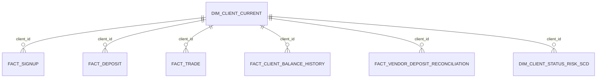

# Part 2: Data Model

## Modeling choice

The gold layer uses a Kimball-style star schema because the domain is compact, the business events are naturally fact-oriented, and the main objective is analytics consumption rather than operational integration.

This keeps the final model understandable, performant, and easy to aggregate into a curated activity mart.

## Gold model overview

## Gold entities and grains

### `dim_client_current`

Purpose:

- one current row per client
- stable descriptive attributes used broadly in analytics

Typical columns:

- `client_id`
- `signup_date`
- `country`
- `account_type`
- `kyc_status`
- `is_deleted`
- current risk and status pointers if useful for convenience

Grain:

- one row per `client_id`

### `dim_client_status_risk_scd`

Purpose:

- preserve historical changes for `risk_category` and `account_status`

Key columns:

- `client_id`
- `risk_category`
- `account_status`
- `effective_from`
- `effective_to`
- `is_current`
- `is_deleted`

Grain:

- one row per `client_id` per distinct status or risk period

Historization choice:

- SCD Type 2

Reason:

- risk category and account status are meaningful business state transitions that analysts often need point-in-time access to

### `fact_client_balance_history`

Purpose:

- keep account balance changes in a narrow history structure

Key columns:

- `client_id`
- `account_balance_usd`
- `effective_from`
- `effective_to`

Grain:

- one row per `client_id` per distinct balance-validity period

Historization choice:

- separate narrow history fact instead of full-row SCD2

Reason:

- balance is high-churn and would bloat a wide SCD if stored alongside many stable descriptive attributes

### `fact_signup`

Purpose:

- record the signup event itself

Key columns:

- `client_id`
- `signup_date`
- `signup_channel`
- `country_at_signup`

Grain:

- one row per client signup

### `fact_deposit`

Purpose:

- analytic deposit fact built from standardized deposit sources

Key columns:

- `deposit_id`
- `client_id`
- `deposit_date`
- `amount_usd`
- `fee_usd`
- `payment_method`
- `deposit_status`

Grain:

- one row per `deposit_id`

### `fact_trade`

Purpose:

- analytic trade fact for activity and profitability analysis

Key columns:

- `trade_id`
- `client_id`
- `trade_date`
- `instrument`
- `realized_pnl_usd`

Grain:

- one row per `trade_id`

### `fact_vendor_deposit_reconciliation`

Purpose:

- compare vendor deliveries to modeled deposit facts and expose mismatches

Key columns:

- `reconciliation_run_id`
- `deposit_id`
- `client_id`
- `reconciliation_status`
- `variance_amount_usd`

Grain:

- one row per `deposit_id` per reconciliation run

## CDC apply logic

### Bronze to silver

- store raw CDC lines with load metadata
- parse JSONL rows
- dedupe by `lsn`
- sort strictly by `lsn`

### Silver to gold

`insert`

- create the current client row if the client does not exist
- if the client already exists because of baseline bootstrap, treat the event as an overlap and reconcile by business key

`update`

- if `risk_category` or `account_status` changes, close the active SCD2 row and insert a new current row
- if `account_balance_usd` changes, append a new balance-history validity row
- update `dim_client_current` to the latest state

`delete`

- close the active SCD2 row
- mark the client as deleted in current-state logic
- exclude deleted clients from default curated views

## Late-arriving dimensions

If a fact arrives before the client dimension row:

- create a temporary inferred member in `dim_client_current`
- keep minimal attributes only
- backfill the conformed dimension once the client record arrives
- quarantine the fact if no valid dimension row appears within the SLA window

This avoids losing a deposit or trade while still enforcing eventual referential integrity.

## Historical reload strategy

When historical repair is needed:

1. Select the affected date range and clients.
2. Re-read the relevant bronze deliveries.
3. Rebuild ordered silver state for just the impacted slice.
4. Recompute the affected gold timelines and validity windows.
5. Replace or merge atomically after validation.

Rule:

- never patch history in place without rebuilding the impacted client timelines from baseline plus ordered CDC

## Wide 250+ field source pattern

If the client source expands to hundreds of attributes, do not apply full-row SCD2 across the entire record.

Recommended split:

- current wide dimension for latest state
- narrow history tables for analytically important changing attributes
- optional attribute-group satellites later if governance or access patterns justify them

This controls storage growth and keeps historical logic focused on fields that matter analytically.

## Curated model: `client_activity`

The curated layer exposes one analytic row per client using gold models only.

Required fields:

- `client_id`
- `country`
- `signup_date`
- `account_type`
- `kyc_status`
- `first_deposit_date`
- `first_trade_date`
- `total_deposit_count`
- `total_deposit_amount_usd`
- `total_trade_count`
- `total_realized_pnl_usd`
- `last_trade_date`
- `last_deposit_date`
- `is_funded_client`
- `is_trading_client`

Definition logic:

- join `dim_client_current` to `fact_signup`
- aggregate `fact_deposit` by client
- aggregate `fact_trade` by client
- compute boolean activity flags from aggregate counts

Current scope boundary:

- `total_withdrawals` is intentionally not included because no withdrawal source exists in the supplied data scope

The SQLite-compatible implementation for this model is in `sql/client_activity.sql`.

## Part 2c: Query A

The deposit-count-by-country query is implemented in `sql/query_a_deposit_count_by_country.sql`.

Validation-critical behavior:

- it uses a `LEFT JOIN` from clients to deposits
- it counts only completed deposits
- countries with zero deposits are retained in the result instead of being filtered out by an `INNER JOIN`
